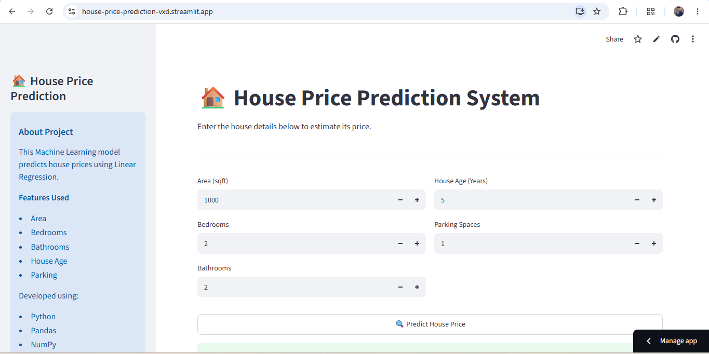

# 🏠 House Price Prediction using Linear Regression

## 🌐 Live Demo

**Try the application here:**

https://house-price-prediction-vxd.streamlit.app/

An end-to-end Machine Learning project that predicts house prices based on property features using the **Linear Regression** algorithm. The project covers the complete workflow from data preprocessing and exploratory data analysis (EDA) to model training, evaluation, and deployment with **Streamlit**.

---

<p align="center">
  
</p>

## 📌 Project Overview

This application allows users to estimate house prices by entering key property details through an interactive web interface. The trained Linear Regression model processes the input values and provides an instant price prediction.

---

## ✨ Key Features

- 🧹 Data Cleaning & Preprocessing
- 📊 Exploratory Data Analysis (EDA)
- 🤖 Linear Regression Model
- 📈 Model Evaluation
- 💾 Model Serialization using Joblib
- 🌐 Interactive Streamlit Web Application
- ⚡ Real-Time House Price Prediction

---

## 🛠️ Tech Stack

| Category | Technologies |
|----------|--------------|
| Programming Language | Python |
| Data Analysis | Pandas, NumPy |
| Visualization | Matplotlib |
| Machine Learning | Scikit-Learn |
| Deployment | Streamlit |
| Model Saving | Joblib |

---

## 📂 Dataset Features

The model uses the following features to predict house prices:

| Feature | Description |
|---------|-------------|
| Area | Area of the house (sqft) |
| Bedrooms | Number of bedrooms |
| Bathrooms | Number of bathrooms |
| House Age | Age of the house |
| Parking | Number of parking spaces |

**Target Variable:** House Price

---

## 📈 Machine Learning Workflow

```text
Dataset
   ↓
Data Cleaning
   ↓
EDA
   ↓
Feature Engineering
   ↓
Model Training
   ↓
Model Evaluation
   ↓
Model Saving
   ↓
Streamlit Deployment
```
---

## 📊 Project Highlights

- End-to-End Machine Learning Project
- Interactive Prediction Interface
- Clean and Simple User Experience
- Real-Time House Price Prediction
- Beginner-Friendly Project Structure

---

## 🚀 Future Enhancements

- Compare performance with Decision Tree and Random Forest Regression
- Add location-based house price prediction
- Include additional property features
- Generate downloadable prediction reports

---

## ⭐ Support

If you found this project helpful, consider giving it a ⭐ on GitHub.